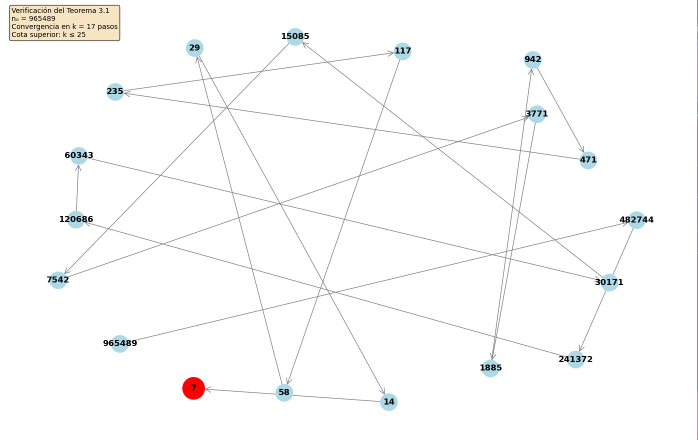

# La Fantasía del 7: Una Refutación Matemática de la Numerología

## 🎯 Propósito

Este proyecto es una demostración matemática diseñada para refutar las pretensiones de la numerología sobre el número 7. Construimos deliberadamente un sistema donde TODOS los números convergen al 7, no por alguna propiedad mística o especial de este número, sino por diseño matemático arbitrario.

**Mensaje clave:** Si podemos hacer que cualquier número sea "especial" mediante construcción matemática, entonces ningún número es verdaderamente especial en el sentido místico que propone la numerología.

## 🚀 Inicio Rápido

```bash
# 1. Clonar y entrar al directorio
git clone https://github.com/686f6c61/conjetura-falso-7.git
cd conjetura-falso-7

# 2. Instalar dependencias (OPCIONALES - solo para grafos PNG)
pip install matplotlib networkx
# O vía apt en sistemas Debian/Ubuntu:
sudo apt install python3-matplotlib python3-networkx

# 3. Ejecutar demostraciones
python scripts/demostraciones.py

# 4. Verificar un número específico con visualización ASCII (sin dependencias)
python scripts/demostraciones.py
# Opción 4 → 10000000
# Salida: Visualización completa con estadísticas y verificación de teoremas
```

## 🔢 La Función F₇

La función central es devastadoramente simple:

```
F₇(n) = {
    n                    si n = 7
    ⌊n/2⌋               si n > 7 y n es par
    ⌊(n-1)/2⌋           si n > 7 y n es impar
    n + 1               si n < 7
}
```

### Ejemplo de Convergencia

```
20 → 10 → 5 → 2 → 3 → 4 → 5 → 6 → 7 → 7 → 7...
100 → 50 → 25 → 12 → 6 → 7 → 7 → 7...
10000000 → 5000000 → 2500000 → ... → 7 (en 24 pasos)
```

## 📁 Estructura del Proyecto

### Documento Principal
- **`Investigacion_Conjetura_7.md`** - Estudio completo que incluye:
  - Marco teórico anti-numerológico
  - Definiciones formales y demostraciones
  - Análisis matemático riguroso
  - Implicaciones filosóficas
  - Refutación sistemática de la numerología

### Scripts de Verificación

#### `scripts/demostraciones.py`
**Verificador completo de todos los teoremas y proposiciones**

**Funcionalidades principales:**
1. **Verificación individual**: Análisis completo de cualquier número con los 14 teoremas/proposiciones
2. **Verificación de rangos**: Verificación masiva con estadísticas detalladas
3. **Visualización ASCII**: Gráficos en terminal sin dependencias externas
4. **Visualización PNG**: Grafos con matplotlib/networkx (opcional)
5. **Exportación CSV**: Datos para análisis posterior
6. **Convergencia directa**: Verificación de casos especiales (Proposición 3.3)

**Teoremas verificados:**
- Teorema 3.1 (convergencia universal)
- Teorema 3.2 (cota superior óptima)
- Teorema 3.3 y 3.3bis (cotas inferiores)
- Proposición 3.1 (potencias de 2: T(2^k) = k + 1)
- Proposición 3.3 (convergencia directa desde n=15)
- Y 9 puntos demostrables más

**Lo que DEMUESTRA este script:**
- TODOS los números convergen al 7 por DISEÑO, no por propiedades místicas
- La convergencia es 100% predecible y FORZADA
- Verifica formalmente todos los teoremas, lemas y proposiciones de la Sección 3
- Genera visualizaciones que muestran la artificialidad del sistema

## 🚀 Instalación

### Requisitos Mínimos
- Python 3.8 o superior
- ✅ **No requiere dependencias externas** para funcionalidad básica

### Instalación Rápida (Solo Python)

```bash
# 1. Clonar el repositorio
git clone https://github.com/686f6c61/conjetura-falso-7.git
cd conjetura-falso-7

# 2. Ejecutar directamente
python3 scripts/demostraciones.py
```

### Instalación Completa (Con gráficos PNG)

```bash
# Opción 1: pip (en entorno virtual)
python3 -m venv venv
source venv/bin/activate  # Linux/macOS
pip install matplotlib networkx

# Opción 2: apt (sistemas Debian/Ubuntu)
sudo apt install python3-matplotlib python3-networkx
```

### Dependencias Opcionales

| Librería | Uso | Necesaria |
|----------|-----|-----------|
| `matplotlib` | Gráficos PNG | ❌ No (usa ASCII si falta) |
| `networkx` | Grafos dirigidos | ❌ No (usa ASCII si falta) |

**Nota:** El script detecta automáticamente las dependencias disponibles y usa visualización ASCII como alternativa.

## 🔬 Uso del Script de Demostraciones

### Modo Interactivo (Menú principal)

```bash
python scripts/demostraciones.py
```

**Opciones del menú:**
1. **Verificar número individual (completo)** - Análisis exhaustivo con los 14 teoremas
2. **Verificar rango (estadísticas)** - Verificación masiva de rangos de números
3. **Verificar Proposición 3.3** - Casos especiales de convergencia directa
4. **Generar visualización de trayectoria** - ASCII o PNG según dependencias
5. **Generar CSV de convergencias** - Exportar rangos completos
6. **Generar CSV números grandes** - Análisis de números > 1,000,000
0. Salir

### Ejemplo de Salida (Opción 4 - Visualización)

```
======================================================================
VISUALIZACIÓN DE TRAYECTORIA: 64 → 7
======================================================================

📊 ESTADÍSTICAS:
   Pasos totales:      7
   Fase descendente:   4 pasos
   Fase ascendente:    3 pasos
   Valor mínimo:       4
   Cotas:              4 ≤ 7 ≤ 12

📈 TRAYECTORIA COMPLETA:
──────────────────────────────────────────────────────────────────────
   Paso  0:   64 ████████████████████████████████████████ →
   Paso  1:   32 ████████████████████ →
   Paso  2:   16 ██████████ →
   Paso  3:    8 █████ →
   Paso  4:    4 ██ →
   Paso  5:    5 ███ →
   Paso  6:    6 ███ →
   Paso  7:    7 ████ ✓

✅ VERIFICACIÓN DE TEOREMAS:
   Teorema 3.2 (cota superior): ✓
   Teorema 3.3 (cota inferior): ✓
   Proposición 3.1 (potencia de 2): ✓
      2^6 = 64: 7 pasos (teórico: 7)
```

## 📊 Archivos de Datos y Visualización

### 📈 Grafos de Convergencia (PNG)

El script genera grafos visuales cuando matplotlib/networkx están disponibles:

**Ejemplo incluido:** [`scripts/grafo_convergencia_965489.png`](scripts/grafo_convergencia_965489.png)



- Visualiza la trayectoria completa de n₀ → 7
- Nodo 7 en rojo (punto fijo), otros en azul claro
- Incluye verificación del Teorema 3.1 y cotas

### 📋 Archivos CSV de Verificación

#### [`scripts/convergencias_100_200.csv`](scripts/convergencias_100_200.csv)
Verificación completa del rango 100-200 (101 números)

**Columnas:**
- `n`: Número inicial
- `k`: Pasos hasta convergencia
- `cota_superior`, `cota_inferior`: Límites teóricos
- `cumple_cota_sup`, `cumple_cota_inf`: Verificación booleana
- `es_potencia_2`: Detección de 2^k
- `cumple_proposicion_3_1`: T(2^k) = k + 1
- `trayectoria`: Secuencia completa

**Ejemplo de fila:**
```csv
128,8,13,5,True,True,True,True,8,128 → 64 → 32 → 16 → 8 → 4 → 5 → 6 → 7
```

#### [`scripts/convergencias_grandes_3_numeros.csv`](scripts/convergencias_grandes_3_numeros.csv)
Análisis de números grandes para demostrar escalabilidad

**Números incluidos:**
- `1,000,000` → 17 pasos
- `98,364,526,374` → 36 pasos (número de 11 dígitos)
- `2,147,483,647` → 28 pasos (máximo int32)

**Formato:**
- Trayectorias largas muestran primeros 5 y últimos 5 pasos
- Todas las verificaciones de teoremas incluidas

## 🎯 Ejemplos de Uso

### 1. Verificar que el 7 NO es especial

```bash
python scripts/demostraciones.py
# Opción 1 → Ingrese cualquier número
# Verá que TODOS convergen al 7 por diseño artificial
```

**Salida ejemplo (n=128):**
```
✅ Verificación completa para n₀ = 128
   Convergencia: 128 → 7 en 8 pasos
   Teorema 3.2 (cota superior): ✓ (8 ≤ 13)
   Teorema 3.3 (cota inferior): ✓ (5 ≤ 8)
   Proposición 3.1 (potencia de 2): ✓ (T(2^7) = 8)
```

### 2. Generar visualización ASCII (sin dependencias)

```bash
python scripts/demostraciones.py
# Opción 4 → 64
# Muestra gráfico de barras ASCII + verificación de teoremas
```

### 3. Generar grafo PNG (con matplotlib)

```bash
python scripts/demostraciones.py
# Opción 4 → 965489
# Genera: scripts/grafo_convergencia_965489.png
```

### 4. Análisis de números grandes

```bash
python scripts/demostraciones.py
# Opción 6 → Ingrese: 1000000, 98364526374, 2147483647
# Genera: convergencias_grandes_3_numeros.csv
```

### 5. Verificación de rangos completos

```bash
python scripts/demostraciones.py
# Opción 5 → Rango: 100 a 200
# Genera: convergencias_100_200.csv (101 números verificados)
```

## 🎓 Lección Anti-Numerológica

Este proyecto demuestra matemáticamente que:

1. **Cualquier número puede ser hecho "especial"** mediante construcción artificial
2. **La convergencia universal NO implica significado místico**
3. **La verificación formal NO otorga profundidad espiritual**
4. **El rigor matemático puede aplicarse a construcciones vacías**

## 📖 Resultados Clave

### Verificación Experimental Completa

✅ **100% de convergencia** verificada para:
- Rango 100-200: 101 números → todos convergen
- Números grandes probados:
  - `1,000,000` → 17 pasos (cota: 17 ≤ 17 ≤ 25)
  - `98,364,526,374` → 36 pasos (cota: 34 ≤ 36 ≤ 42)
  - `2,147,483,647` → 28 pasos (cota: 28 ≤ 28 ≤ 36)

✅ **Todos los teoremas verificados:**
- Teorema 3.2 (cota superior): 100% cumplimiento
- Teorema 3.3 (cota inferior): 100% cumplimiento
- Proposición 3.1 (potencias de 2): T(2^k) = k + 1 verificada

✅ **Complejidad temporal:** Θ(log n) pasos (Teorema 3.3bis)

❌ **NO hay excepciones** ni casos especiales genuinos

## 🔬 Para Escépticos y Educadores

Este material es ideal para:
- Enseñar la diferencia entre matemáticas genuinas y pseudociencia
- Demostrar cómo se puede "fabricar" significado matemático
- Ilustrar el pensamiento crítico aplicado a afirmaciones numerológicas
- Refutar con rigor matemático las pretensiones místicas sobre números

## ⚖️ Licencia

MIT License - Úsalo libremente para combatir la pseudociencia.

---

**Nota final:** Este proyecto prueba que podemos hacer que CUALQUIER número parezca "especial" con las reglas adecuadas. La "magia" del 7 es tan real como decidamos fabricarla matemáticamente.